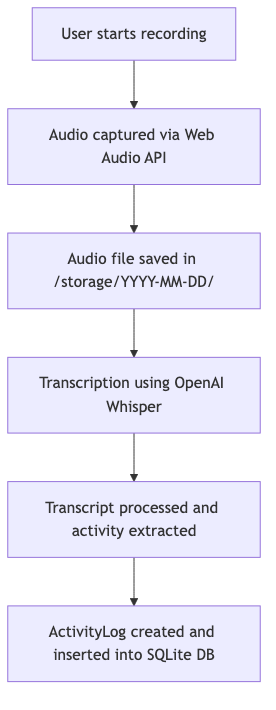
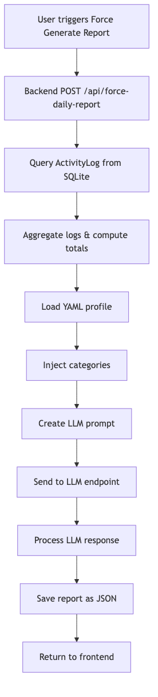
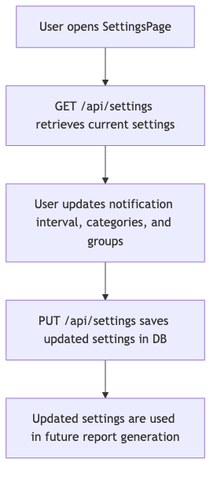

# ActivityLogger – Architectural & Functional Documentation

## Overview

ActivityLogger is a personal web application designed to:
* Capture and transcribe audio recordings.
* Log activities (e.g., work sessions, meetings) into a database.
* Generate detailed daily reports by aggregating activity logs and enriching them via an LLM using YAML-based prompts.
* Support dynamic configuration of activity categories and groups through a nested settings model.

The system consists of a FastAPI backend and a React-based frontend, uses SQLite for data persistence, and stores audio files and generated reports on the local file system.

## Backend Architecture

### Framework & Technologies

#### FastAPI & Uvicorn
The backend is built using FastAPI with Uvicorn as the ASGI server. Live reload is enabled during development.

#### SQLAlchemy & SQLite
The application uses SQLAlchemy to map Python classes to an SQLite database.
* **ActivityLog Model**: Stores each activity (group, timestamp, duration, description).
* **Settings Model**: Supports a nested structure for categories (with each category containing a list of groups), stored as JSON in a text column.

#### File System Storage
* Audio recordings and transcripts are stored in directories organized by date (e.g., `/storage/YYYY-MM-DD/`).
* Generated reports are saved under `/reports/daily/` with filenames formatted as `YYYY-MM-DD_report.json`.

#### LLM Integration & YAML Prompts
* YAML profiles (e.g., `ActivityReports_Daily.yaml`) define the prompt structure for the LLM.
* The prompt contains a `{categories_json}` placeholder that is dynamically replaced at runtime with the nested categories from settings.
* Reports are generated by sending a combined prompt (including real activity logs) to an LLM endpoint.

#### Background Scheduling
A background scheduler (APScheduler) is available (currently disabled or commented out during testing) to trigger periodic report generation.

### Module Organization
* **Models**: Defined in `models.py` (ActivityLog and Settings).
* **Configuration**: The `config.py` module provides helper functions (e.g., `get_categories_json()`).
* **API Endpoints**: Endpoints for recording, settings, and reporting are separated into modules (e.g., `api.py` and the merged `reports.py`).
* **Report Generation**: The merged reports module aggregates real logs, loads a YAML prompt, injects nested categories, calls the LLM, and saves the final report.

## Frontend Architecture

### Framework & Structure
* **React**: The frontend is built using React with functional components, and it uses hooks (useState, useEffect) for local state management.
* **Routing**: Navigation between pages (Recording, Reports, Settings) is handled with react-router-dom.

### UI Components
* **ReportsPage.js**: Fetches daily reports via Axios, allows forcing report generation, and displays a structured layout (Executive Summary and Details).
* **SettingsPage.js**: Provides a UI for updating configuration, including the nested categories and groups.

### Data Flow
* The ReportsPage component initializes the report date in ISO format and fetches the corresponding daily report from the backend.
* Users can force report generation via a dedicated button, which calls the `/api/force-daily-report` endpoint.
* The UI displays the report with a clean layout showing an Executive Summary (with total time and breakdown) and a Details section listing each activity.

## Functional Flows

Below are diagrams that illustrate the key functional flows:

### 1. Recording & Activity Log Insertion Flow

**Description**: When a user starts a recording, the app captures audio, saves it to disk, transcribes it, and then processes the transcript to extract activity information. This information is stored in the ActivityLog table.

### 2. Daily Report Generation Flow

**Description**: When generating a daily report, the backend fetches logs for the given date, aggregates the data, and loads the YAML prompt. It replaces the {categories_json} placeholder with the nested categories from settings, appends the real logs data, and sends this to the LLM. The LLM returns an enriched report, which is saved to a file and then returned to the frontend.

### 3. Settings Update Flow

**Description**: The SettingsPage fetches current configuration, including nested categories, from the backend. The user can modify settings, and the changes are saved via the PUT endpoint. These updated settings are then injected into the report generation process.

## Final Observations

* **LLM Integration**: Daily reports now consistently reach the LLM using the YAML prompt with the nested categories injected. The LLM uses both the activity logs and the categories information to generate a narrative report.
* **Code Organization**: All report-related code is merged into a single module (`reports.py`), which simplifies maintenance and reduces duplication.
* **UI Improvements**: The ReportsPage now displays a cleaner layout with distinct sections for the Executive Summary and Details. The previously separate Markdown summary has been removed.
* **Robustness & Extensibility**: The architecture separates concerns (recording, reporting, settings), making it easier to extend—for example, by adding weekly or annual reports in the future.

## Conclusion

The ActivityLogger application is now built on a solid architecture with:
* A FastAPI backend that handles recordings, activity log storage, and report generation (including LLM integration for enriched narratives).
* A React frontend that provides a user-friendly interface for recording, reporting, and updating settings.

All major issues identified in earlier iterations have been addressed. This documentation serves as a comprehensive foundation for both understanding the current system and guiding future enhancements and detailed documentation efforts.